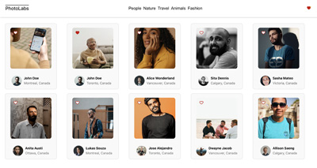
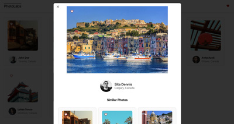
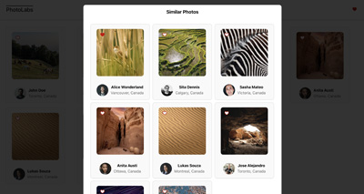

# react-photolabs

The PhotoLabs project for the Web Development React course programming.

# Photolabs

## Setup

Install dependencies with `npm install` in each respective `/frontend` and `/backend`.

## [Frontend] Running Webpack Development Server

#### Frontend Dependencies

```json
 "dependencies": {
        "@testing-library/jest-dom": "^5.16.5",
        "@testing-library/react": "^13.4.0",
        "@testing-library/user-event": "^13.5.0",
        "react": "^18.2.0",
        "react-dom": "^18.2.0",
        "react-scripts": "^5.0.1",
        "web-vitals": "^2.1.4"
    }
```

#### Backend Dependencies

```json
 "dependencies": {
    "body-parser": "^1.18.3",
    "cors": "^2.8.5",
    "dotenv": "^7.0.0",
    "express": "^4.16.4",
    "helmet": "^3.18.0",
    "pg": "^8.5.0",
    "socket.io": "^2.2.0",
    "ws": "^7.0.0"
  }
```

```sh
cd frontend
npm start
```

## [Backend] Running Backend Servier

Read `backend/readme` for further setup details.

```sh
cd backend
npm start
```

## Screen Shots

##### Home Page



##### Current Image Modal



##### Similar Photos in Modal


